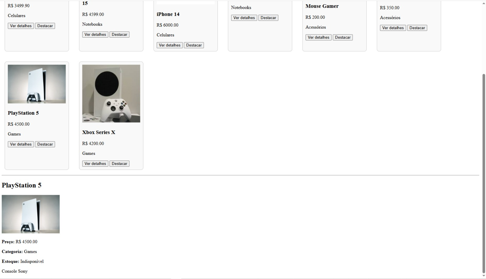
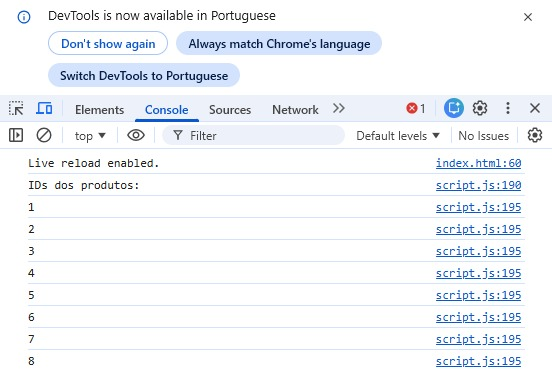

# Trabalho Prático - Semana 9

Nesta atividade, vamos montar um programa para praticar funções em JavaScript e a manipulação do DOM, criando uma tela simples no estilo eCommerce que lista produtos em cards a partir de um objeto JSON (array de produtos).

## Informações Gerais

- Nome: Samuel Kern Janneu  
- Matricula: 1612893

## Prints do trabalho

<<  COLOQUE A IMAGEM - TELA DE CARDS DE PRODUTOS - AQUI >>

<<  COLOQUE A IMAGEM - TELA DE DETALHE DO PRODUTO - AQUI >>

<<  COLOQUE A IMAGEM - TELA DO CONSOLE - AQUI >>

